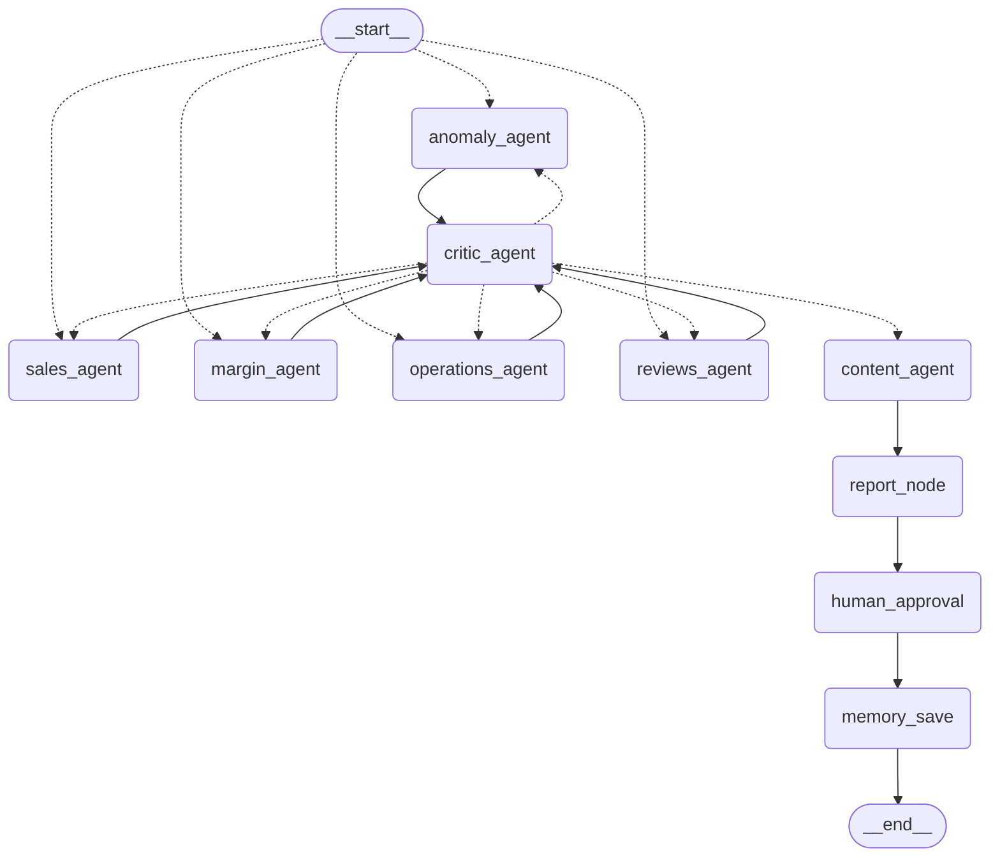

# Cafe Intelligence Agent — Qahwa Saihat

A weekly, autonomous, multi-agent system that reads a cafe's raw data across
six sources, cleans it, runs five parallel analysts with a critic gatekeeping
every claim, turns the verified findings into TikTok/Instagram ideas grounded
in the data + local context + the calendar, and delivers a bilingual
WhatsApp summary and full HTML report — pausing for the owner's approval
before anything goes out, and remembering every week that came before.

Built as a 3-person project (ingestion, analysis, content/delivery), and this
README is the one place that ties all three parts together into a single
runnable system.

## Run it — one command

```bash
git clone <this repo>
cd cafe-intelligence-agent-main
python3 -m venv venv && source venv/bin/activate   # Windows: venv\Scripts\activate
pip install -r requirements.txt
cp .env.example .env        # then fill in whichever keys you have — see below
python3 run_full_pipeline.py --real
```

That single command runs the entire pipeline end to end: ingests and cleans
`data_raw/` if `clean_data/` doesn't exist yet, runs all 5 analysts in
parallel, the critic, the content agent, builds the report, hits the human
approval breakpoint, simulates the owner's reply, and saves memory. Output
lands in `output/`.

```bash
python3 run_full_pipeline.py --real --decision REJECT
python3 run_full_pipeline.py --real --decision "EDIT: custom text"
python3 run_full_pipeline.py --real --week-id 2026-W12   # test a specific week (e.g. Ramadan)
```

**No API keys needed to run this.** Every LLM-backed step has a deterministic,
tested fallback (see "API keys" below for exactly what each key upgrades).

## Architecture

```
START ──▶ [sales_agent, margin_agent, operations_agent, reviews_agent, anomaly_agent]  (parallel)
              │
              ▼
         critic_agent ──(revision needed)──▶ back to the flagged analyst (max 3 loops)
              │ (satisfied)
              ▼
         content_agent  ── 3 TikTok/IG ideas, grounded in margin/trend/stock +
              │            calendar + local search, each citing a real number
              ▼
         report_node    ── WhatsApp summary + full bilingual HTML report + charts
              │              + Waste-to-Riyals + Menu Engineering sections
              ▼
         human_approval ── PAUSES here (langgraph interrupt()) — owner approves,
              │              edits, or rejects via WhatsApp
              ▼
         memory_save    ── records this week + the approval decision for next week
              │
              ▼
             END
```

This is the actual diagram LangGraph draws from the compiled graph
(`full_graph.py`), not hand-illustrated:



**Why split the agents this way.** Ingestion never cleans and cleaning never
analyzes — each stage only trusts the layer before it once that layer's own
job is done, so a bug in one stage can't silently corrupt another's output.
Five analysts run in parallel and independently because their questions
don't depend on each other (sales trend doesn't need margin's answer first);
the critic sits after all five specifically so it can catch
*cross*-analyst contradictions, not just single-analyst mistakes. Content
generation and reporting are separate nodes from analysis because they
consume a fundamentally different kind of input — verified conclusions, not
raw data — and separating them means the report format can change without
touching a single analyst. The human-approval node is its own graph node
(not a side effect inside report generation) specifically so it can
`interrupt()` — LangGraph's checkpointer-backed pause/resume needed a real
node boundary to work at all.

## Project structure

```
data_raw/                    the raw dataset + cafe_profile.json (the config
                              that makes onboarding cafe #2 = new files, not new code)
config/sources_config.json   source registry Person 1's ingestion reads

parsers/, cleaning/,         INGESTION + CLEANING (Person 1)
ingestion_graph.py, clean_data.py
  -> produces clean_data/*.csv + quality_report.json
  -> details: docs_ingestion_details.md

agents/, state.py, graph.py, ANALYSIS + CRITIC + MEMORY + SCHEDULER (Person 2)
memory/store.py, scheduler/scheduler.py
  -> produces verified_findings: list[{agent, claim, number, evidence}]
  -> details: docs_analysis_details.md

content/, report/,           CONTENT AGENT + DELIVERY + CONTROL (Person 3)
full_graph.py, run_full_pipeline.py,
scheduler/full_scheduler.py
  -> produces content_ideas, report_html, whatsapp_summary, report_approved
  -> details: docs_content_report_details.md

tests/                       full pipeline test suite (14 tests)
.env.example                 every environment variable this project reads, and where
```

`full_graph.py` is the merge point: it imports Person 2's analyst/critic
node functions directly (not copy-pasted) and Person 3's content/report/
approval/memory nodes, and wires them into one compiled graph. `graph.py`
(analysis-only) and `scheduler/scheduler.py` still exist and still work —
they're the building blocks `full_graph.py` and `scheduler/full_scheduler.py`
extend, kept as-is rather than deleted so Person 2's own standalone tests
(`python agents/sales.py`, `python graph.py --real`, etc.) still run.

## API keys — where they go and exactly what they do

Copy `.env.example` to `.env` and fill in whichever of these you have. Every
one is optional — the pipeline runs and produces a complete report with
none of them set.

| Variable | Get it at | Used by (exact function) | What happens without it |
|---|---|---|---|
| `GOOGLE_API_KEY` | [aistudio.google.com/apikey](https://aistudio.google.com/apikey) | `agents/margin.py`'s `extract_price_change_events()`, `agents/reviews.py`'s `summarize_low_rated_themes()`, `agents/critic.py`'s soft-check, `content/content_agent.py`'s LLM idea mode, `content/translate.py`'s Arabic translation | Margin/reviews use hand-verified stub values (sandbox mode); content ideas and translation use deterministic templates. Everything still runs and is tested this way. |
| `ANTHROPIC_API_KEY` | [console.anthropic.com](https://console.anthropic.com/settings/keys) | Same call sites as `GOOGLE_API_KEY`, used as the fallback if Google's key isn't set | Same as above |
| `TAVILY_API_KEY` | [tavily.com](https://tavily.com) | `content/local_context.py`'s `search_local_events()`, called from `content/content_node.py` | Content ideas fall back to calendar context only (Ramadan/Eid/summer-heat still works — that's computed locally, not via search) — the report will say "No local event search results this run" |
| `LANGCHAIN_TRACING_V2` + `LANGCHAIN_API_KEY` + `LANGCHAIN_PROJECT` | [smith.langchain.com](https://smith.langchain.com) → Settings → API Keys | **Nowhere in this project's own code** — that's how LangSmith works. Setting these three env vars auto-instruments every LangChain/LangGraph call in the process. | No trace is recorded. `run_full_pipeline.py` prints an explicit ENABLED/NOT-enabled line at the start of every run so this is never silently unverified. |
| `CONTENT_AGENT_COST_CAP_USD` | (you set the number) | `content/cost_tracker.py`, checked inside `content/content_agent.py` and `content/translate.py` before each LLM call | Defaults to $0.50/call-site if unset |

**To turn on real LLM calls (Gemini) and stop the sandbox-mode stubbing:**
```bash
# in .env
GOOGLE_API_KEY=AIzaSy...
```
**To turn on local-events search:**
```bash
# in .env
TAVILY_API_KEY=tvly-...
```
**To turn on LangSmith tracing (a required deliverable):**
```bash
# in .env
LANGCHAIN_TRACING_V2=true
LANGCHAIN_API_KEY=ls__...
LANGCHAIN_PROJECT=cafe-intelligence-agent
```
Then just re-run `python3 run_full_pipeline.py --real` — no code changes needed
for any of these, only the `.env` file.

## Scheduling — proving it fires on its own

```bash
python -m scheduler.full_scheduler --now
```
Fires the entire pipeline immediately (same as a real cron would), runs
unattended up to the human-approval pause, and writes the pending decision to
`pending_approvals.json`. To actually start the recurring weekly schedule:
```bash
python -m scheduler.full_scheduler
```
Once the owner's real WhatsApp reply comes in (whatever receives it in a
real deployment — a webhook, a support inbox), resume the same paused run:
```bash
python -m scheduler.full_scheduler --resume 2026-W31 --decision APPROVE
```

## Testing

```bash
python -m pytest tests/test_person3_integration.py -v
```
14 tests, all passing with zero API keys configured: findings-schema
handling, content-idea grounding (including the margin/trend/stockout
selection and the Eid-al-Fitr calendar tie-in), waste-analysis and
menu-engineering sanity checks, cost-tracker budget enforcement, WhatsApp/
HTML rendering correctness, and two full `full_graph.py` runs through the
real `interrupt()`/`Command(resume=...)` roundtrip (including the scheduler's
pause/resume path).

## Bonus features (2, per the assignment's "pick at least 2")

- **Waste-to-Riyals** — quantifies real monthly waste cost per item and
  proposes a corrected weekly order quantity. On the real dataset: SAR
  4,468/month total waste, ~SAR 2,350/month recoverable. (`content/waste_analysis.py`)
- **Menu Engineering** — classic four-quadrant popularity × margin
  classification (star/plowhorse/puzzle/dog) with concrete cut
  recommendations. (`content/menu_engineering.py`)

Both appear in the actual WhatsApp summary and HTML report, not just in code.

## Known limitations — stated plainly, not hidden

- **`inventory_weekly.csv` only tracks bakery/food SKUs.** Stockout-risk
  checking (used by the content agent's "don't promote something about to
  run out" logic) can never apply to drinks — that's a property of the
  source dataset, not a bug.
- **Tavily and LangSmith have never been exercised with real credentials**
  in the environment this was built in — the code paths are complete and
  tested for their fallback behavior, but the "real" behavior is unverified
  until someone runs it with actual keys.
- **`content/cost_tracker.py` only covers Person 3's own LLM call sites** —
  Person 2's `agents/margin.py`/`reviews.py`/`critic.py` make their own
  separate LLM calls with no equivalent budget check.
- **Idea #1 (margin/trend/stockout pick) cites a Person-3-computed metric**,
  not a critic-approved finding — clearly labeled everywhere it appears, but
  worth knowing if "cites the finding" is read strictly.
- Full details, including the specific bugs found and fixed during review
  (invented product pairings, wrong posting times, the Eid-al-Fitr
  calendar-guessing bug), are in `docs_content_report_details.md`.

## Onboarding a second cafe

Swap `data_raw/cafe_profile.json` and point `config/sources_config.json`'s
`data_dir` at the new files. No code in `parsers/`, `agents/`, `content/`, or
`report/` should need to change — everything reads the cafe name, city,
hours, and social handles from the profile, and the analysts/content agent
work off column names, not hardcoded values. (The one KSA-specific exception
is `content/local_context.py`'s `CALENDAR_EVENTS_2026` table, flagged in that
file's docstring as the piece to move into the profile for a non-Saudi cafe.)

## Team documentation

- `docs_ingestion_details.md` — Person 1's parsing/cleaning design decisions
- `docs_analysis_details.md` — Person 2's analyst/critic/memory/scheduler status notes
- `docs_content_report_details.md` — Person 3's content/report design decisions and fix history
